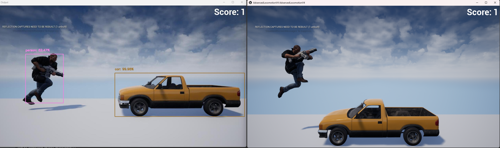

MobileNetSSD running on a Intel I7 13700KF for Real-Time Object Detection in a simple Endless Runner Game made in Unreal Engine 5 Game Engine. The script controls the character avoiding the obstacles based on the detected bounding boxes and the distance between them. [Live Demo](https://www.youtube.com/watch?v=iz0dCG8FkoA&ab_channel=StefanosPas)

